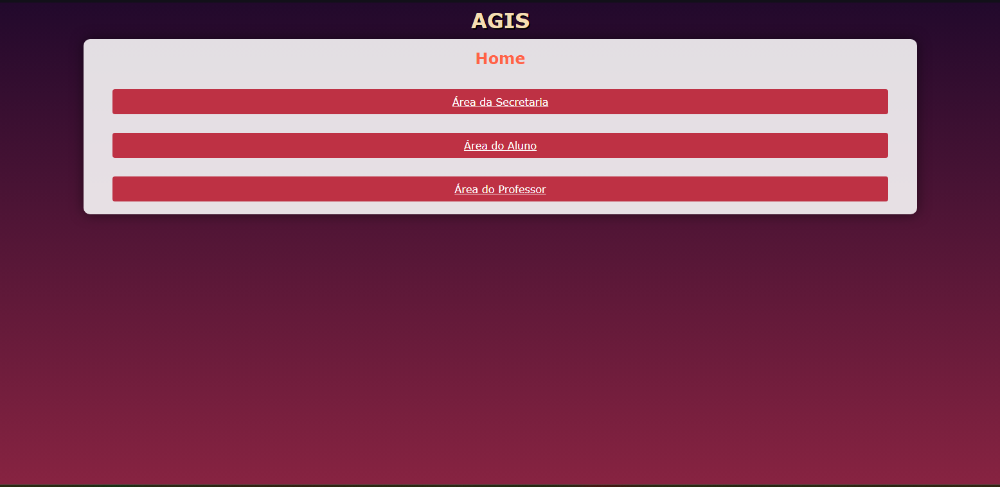
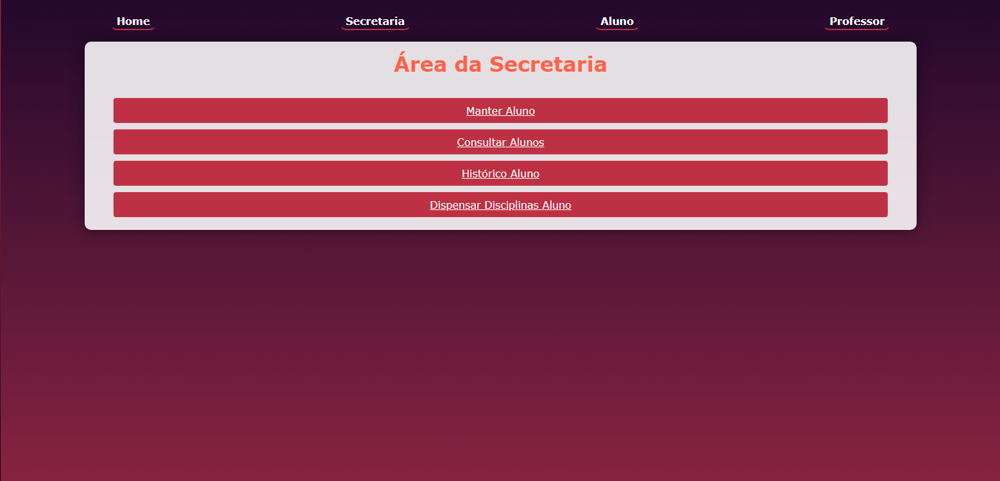
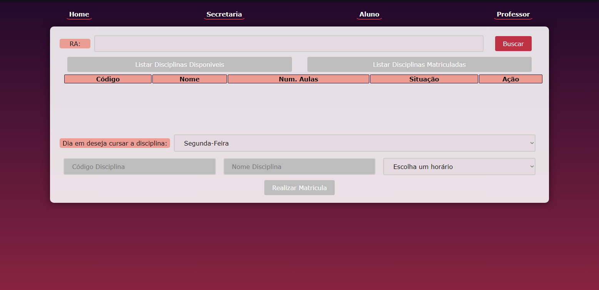
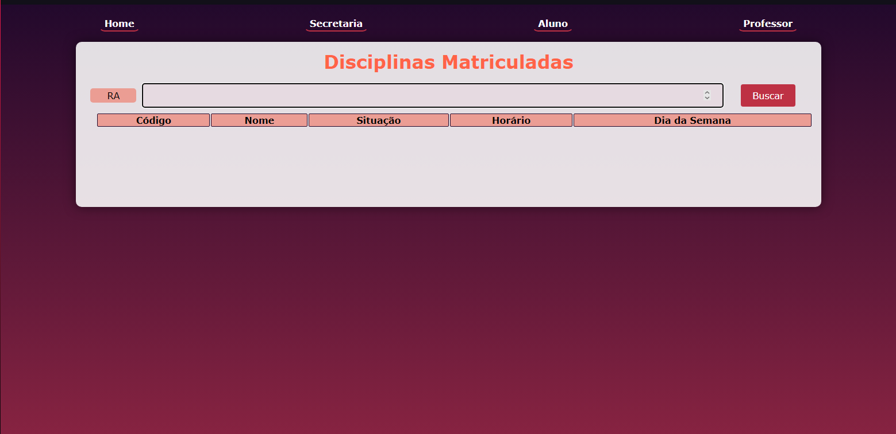
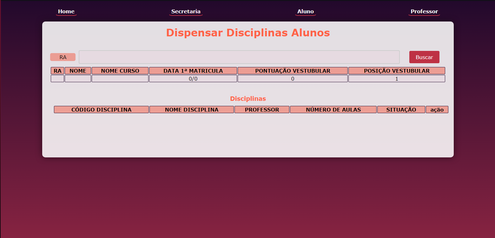
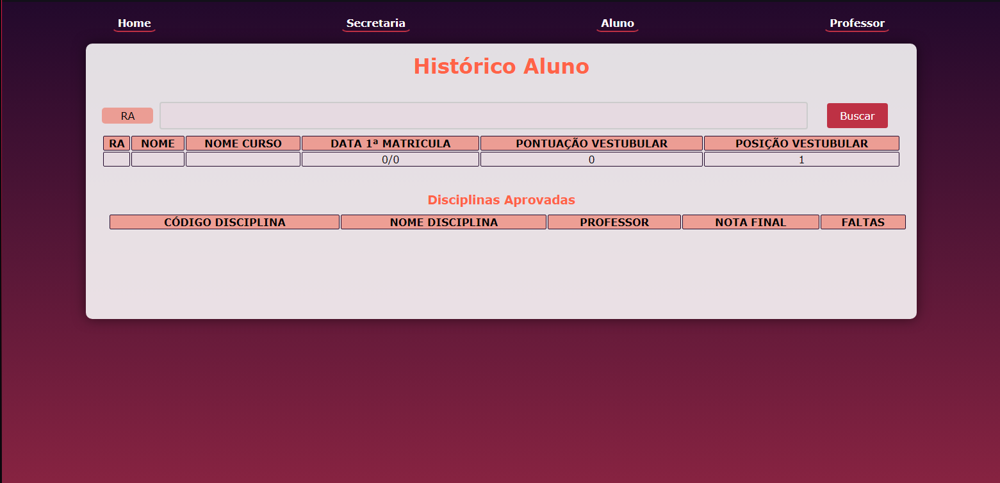
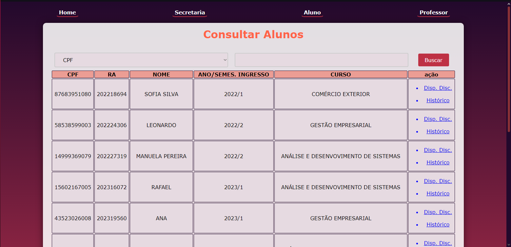
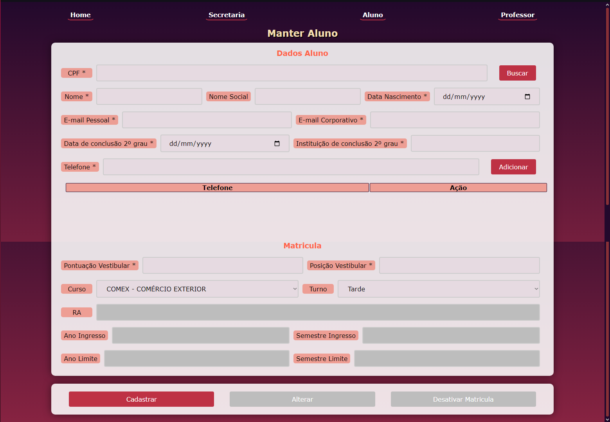
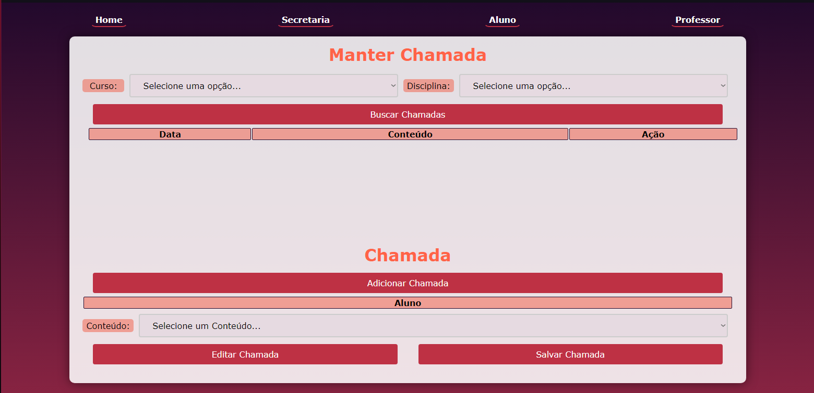

# AGIS
Sistema Integrado de Gestão Acadêmica
****
## Integrantes
  [Débora Cristina da Silva](https://github.com/DeboraCristina)  
  [Luan Camilo Nogueira](https://github.com/Felliny)

## Resumo

Esse sistema foi desenvolvido como 2ª avaliação da disciplina de <i>Laboratório de Banco de Dados</i>

O sistema implemento com funcionalidades <i>básicas</i> de um Sistema de Gestão Acadêmica:

- Matricular alunos
- Permite Secretaria e alunos se matricularem em disciplinas
- Permite que funcionários da Secretaria dispensem disciplinas de alunos
- Permite a realização de chamada
- Consultar dados dos alunos e hitórico

## Sumário
- [Tecnologias Usadas](#tecnologias-usadas)
- [Modelagem do projeto](#modelagem-do-projeto)
- [Screenshots](#screenshots)

## Tecnologias Usadas
Para a modelagem do sistema: <strong><u>Visual Paradigm</u></strong>  
Tecnologia/Linguagens Front-end: <strong><u>HTML, CSS & JAVASCRIPT</u></strong>  
Tecnologia/Linguagens Back-end: <strong><u>JAVA, SpringWeb & SQLServer</u></strong>  

## Modelagem do projeto

## Screenshots

    
    
    

    
    
    

    
    
    

****
